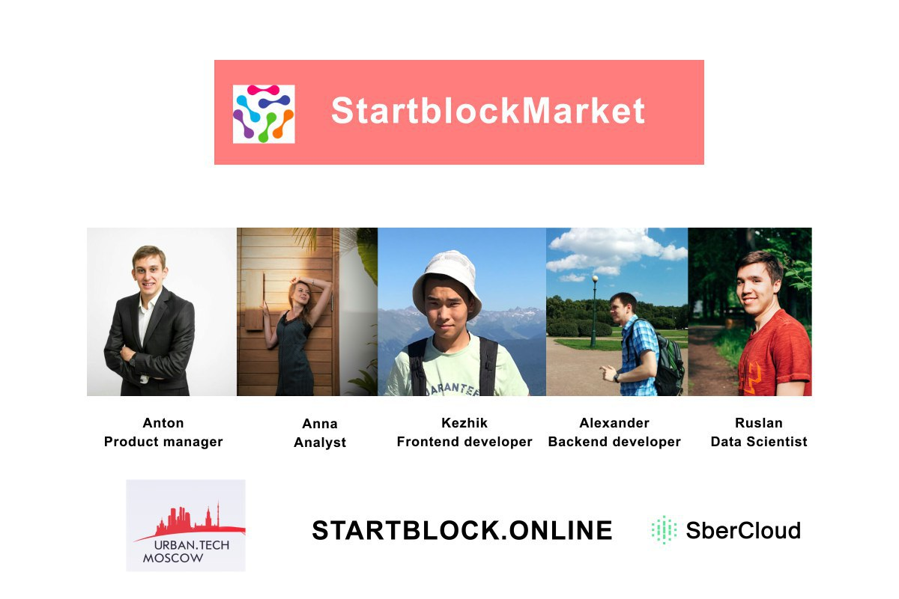

# Маркетплейс IT решений

[](http://startblock.online)

Маркетплейс SberCloud создается в целях расширения функционала базовых облачных сервисов SberCloud (Iaas и PaaS) за счет продуктов экосистемы Сбербанка и продуктов сторонних производителей.

Видео-демонстрация решения: https://drive.google.com/open?id=14NDloMRo1A_lFOP6T2GQVpZ6AUFJGUjf

Интерфейсы пользователей: 

# Содержание

<ol type="1" style="font-size: x-large;">
<li> [Проблема](#проблема)
<li> [Решение](#решение)
<ol type="a" style="font-size: large;">
  <li> [Разработчик](#разработчик)
  <li> [Заказчик](#заказчик)
  <li> [Интегратор](#интегратор)
  <li> [Администраторы](#администраторы)
</ol>
<li> [Монетизация](#решение)
<li> [Бизнес-процессы](#бизнес-процессы)
<li> [Техническая архитектура](#техническая-архитектура)
<li> [Киллер фичи](#киллер-фичи)
<ol type="a" style="font-size: large;">
<li> [ML подборка алгоритма](#ml-подборка-алгоритма)
<li> [Оценки продукта](#оценки-продукта)
<li> [Биллинговая система](#биллинговая-система)
<li> [Сбор аналитики](#сбор-аналитики)
</ol>
<li> [Установка](#установка)
<ol type="a" style="font-size: large;">
  <li> [Frontend](#frontend)
  <li> [Backend](#backend)
  <li> [ML](#ml)
</ol>
<li> [Итоги](#итоги)
<li> [Будущее развитие](#будущее-развитие)
<li> [Команда](#команда)
</ol>

# Проблема

Разработчики (частные/команды/компании):
- Создание продуктов, однако сложно превратить в работающий бизнес
- Нет возможности разворачивать решения
- Нужны клиенты для продуктов

Заказчики (микро/малый/средний бизнес):
- Нужны персонализированные продукты, быстрые по запуску
- Поиск инноваций и улучшения бизнес-процессов в компании

# Решение

Видео-демонстрация решения: https://drive.google.com/open?id=14NDloMRo1A_lFOP6T2GQVpZ6AUFJGUjf

Интерфейсы пользователей: 


### Разработчик


### Заказчик


### Интегратор


### Администраторы


# Монетизация

SberCloud:
- Комиссия за продажи лицензий на маркетплейсе
- 20 % комиссии от стоимости использования образов на облаке
- Биллинговые операции и поддержка при использовании заказчиком
- Предоставление облачного пространства 

Разработчик:
- Использование облачного решения (Ядра/с, VM/c) 
- Подписка по времени
- Продажа лицензий
- Ограниченный функционал решения

Интегратор:
- Партнерская система бонусов от Разработчика и SberCloud
- Пакетные решения и прибавочная стоимость 

# Бизнес-процессы

# Технологический стек

В рамках прототипа за время хакатона:


Глобальная архитектура в будущем:


# Киллер фичи

### ML подборка алгоритма

Чтобы определить, какие ключевые слова нужны для поиска нужных проектов, используется следующее:
- Обученная модель, которая может извлечь ключевые слова из описания задачи.
- Обученная модель, которая может извлечь ключевые слова из описания задач, которые может решить конкретный специалист.
- Алгоритм, который будет соответствовать ключевым словам задачи и специальным тегам.

В нашем проекте мы используем TF-IDF для извлечения ключевых слов. TF-IDF может фактически использоваться для извлечения важных ключевых слов из документа, чтобы получить представление о том, что характеризует документ. Эти ключевые слова можно использовать как очень простое резюме документа и для анализа текста, когда мы смотрим на эти ключевые слова в совокупности. На этом этапе мы использовали библиотеку Python skikit-learn с TF-IDF.

Мы использовали набор данных Stack Overflow, который имитирует то, с чем вы можете иметь дело в реальной жизни. Вы можете найти этот набор данных в нашем репо. Файл "stackoverflow-data-idf.json" с 20 000 публикаций используется для вычисления обратной частоты документа (IDF). Этот набор данных переполнения стека содержит 19 полей, включая заголовок сообщения, текст, теги, даты и другие метаданные, которые нам не нужны для этого проекта. В нашем проекте нас больше всего интересуют тело и заголовок. Они стали нашим источником текста для извлечения ключевых слов.

Мы создали поле, которое сочетает в себе тело и заголовок. Мы использовали CountVectorizer для создания словаря из всего текста в нашем df_idf ['text'], за которым следует количество слов в словаре. Результатом является разреженное матричное представление отсчетов. Каждый столбец представляет слово в словаре. Каждая строка представляет документ в нашем наборе данных, где значения - это количество слов.

Мы передаем два параметра в CountVectorizer, max_df и stop_words. Во-первых, просто игнорировать все слова, которые появились в 85% документов, поскольку они могут быть неважными. Последним является список пользовательских стоп-слов. Вы также можете использовать стоп-слова, которые являются родными для sklearn, установив stop_words = 'english'.

Результирующая форма word_count_vector (20000,124901), так как у нас есть 20 000 документов в нашем наборе данных (строки) и размер словаря составляет 124 901.

В некоторых приложениях для анализа текста, таких как кластеризация и классификация текста, мы обычно ограничиваем размер словаря. Это действительно легко сделать, установив max_features = vocab_size при создании экземпляра CountVectorizer. Для этого проекта мы ограничили наш словарный запас до 10000. Важно: IDF всегда должен быть основан на большой корпорации и должен представлять тексты, которые вы будете использовать для извлечения ключевых слов.

Как только мы вычислим наш IDF, мы готовы вычислить TF-IDF и затем извлечь ключевые слова из векторов TF-IDF.

В нашем проекте мы извлекли ключевые слова из описания задач и ключевые слова из описаний задач специалистов. После этого у вас будет список ключевых слов которые можно использовать для подбора продуктов на платформе.

### Оценки продукта


### Биллинговая система


# Установка

### Frontend

```yarn install```

```yarn build```

```yarn start```

### Backend

```yarn install```

```yarn build```

```yarn start```

### ML

- Python3.6
- Каркас фляги (для веб-сервера)
-Библиотека Skikit-learn (для машинного обучения)
-HTML, CSS

# Итоги


Видео-демонстрация решения: https://drive.google.com/open?id=14NDloMRo1A_lFOP6T2GQVpZ6AUFJGUjf

Интерфейсы пользователей: 


# Будущее развитие

В дальнейшем наша команда StartBlock.Online готова продолжить разработку данной системы на уровне проведения пилота и внедрения в реальный бизнес.

Провести полную аналитику бизнес-требований и предложить наиболее полную конфигурацию для масштабирования системы.

Реализовать полную структуру решения, используя предложенные инструменты и навыки в ML.

# Команда

[](http://startblock.online)
